# eTicket

Ticket System with Firestore/Firebase
Two types of users:
-User
-Organizer

 Organizer can create events, see tickets buyers(Approve/pending), scan ticket qr code for approve

 User can see events, buy tickets,see ticket pending status, see qr code for ticket.

# App Visuals
 

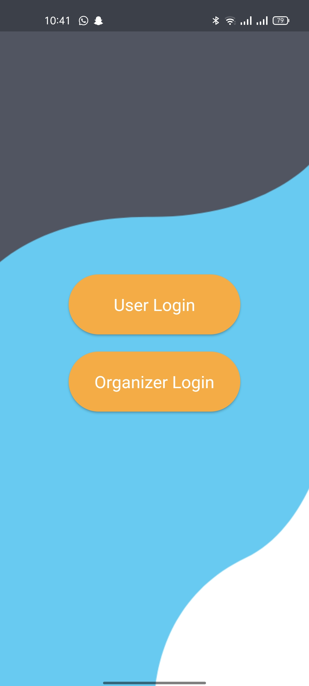

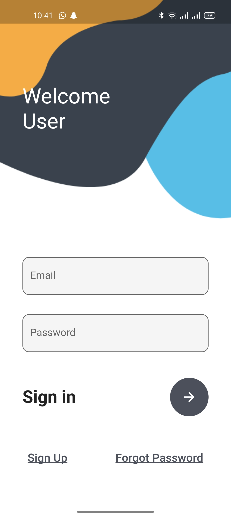

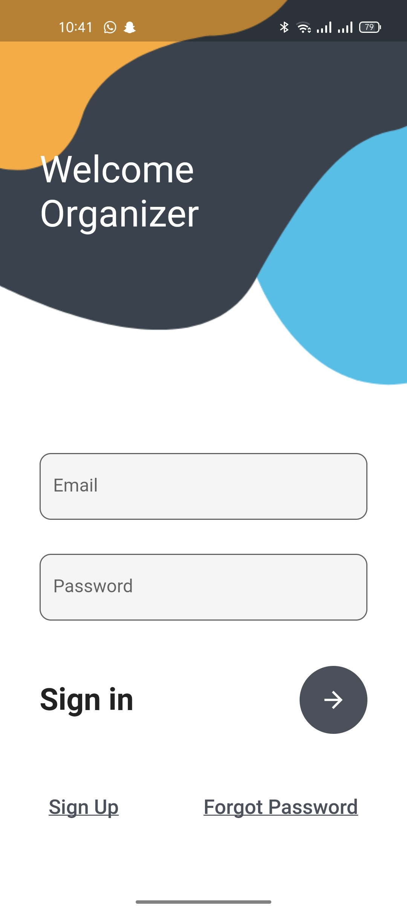

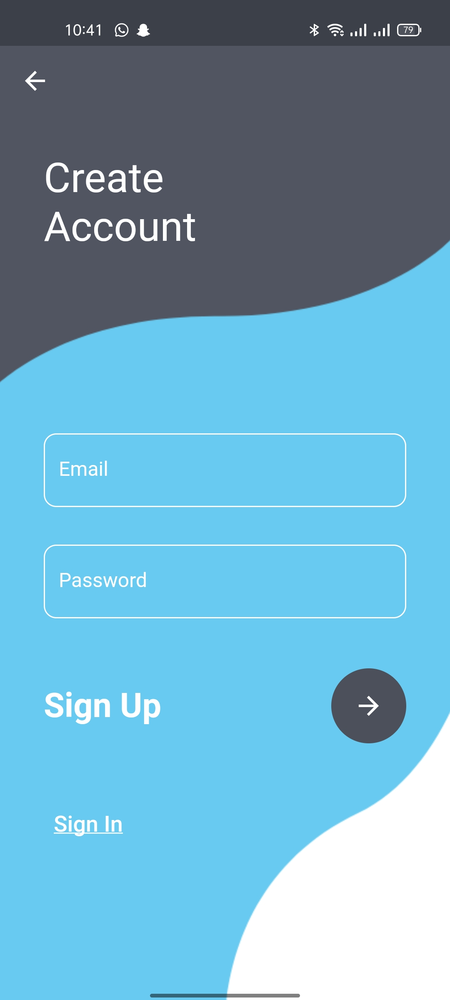

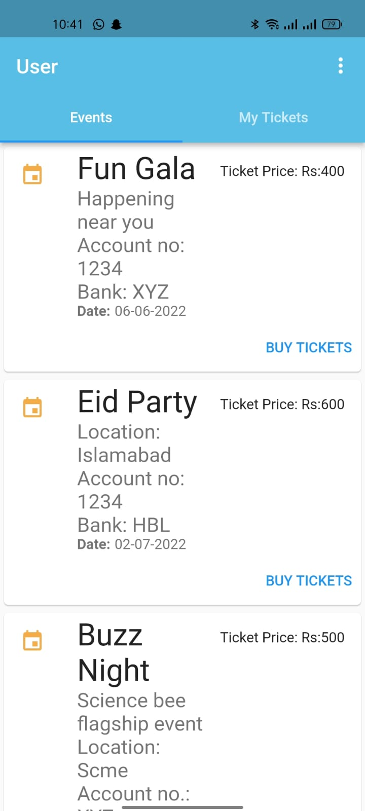
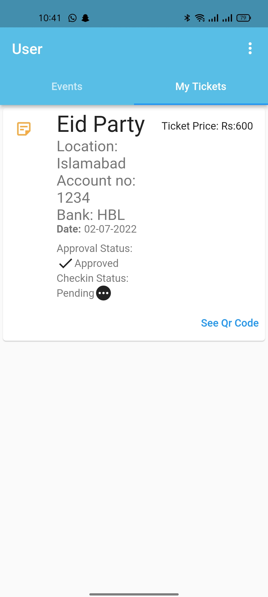

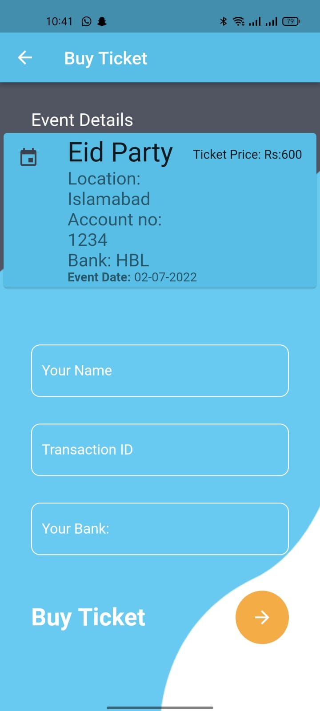
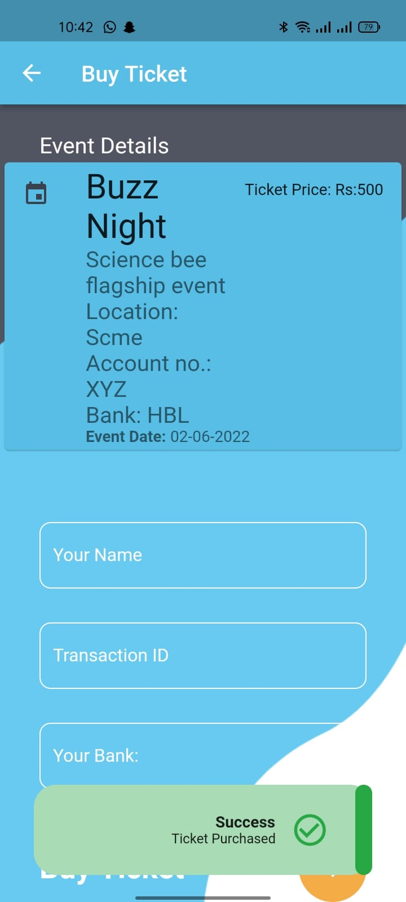
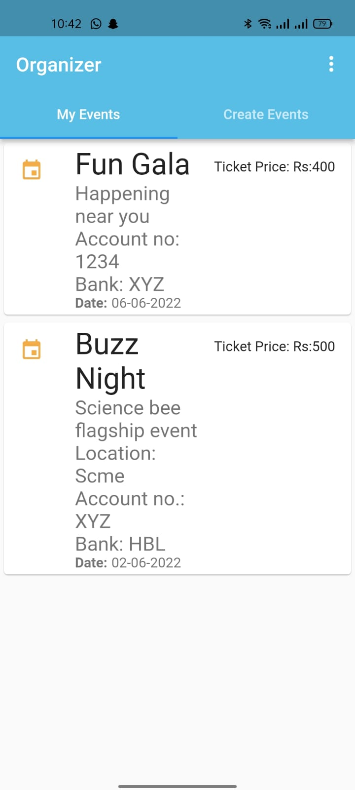

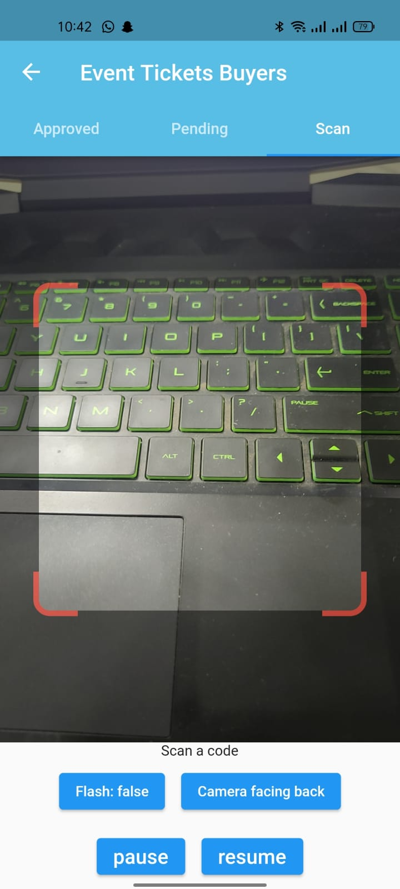
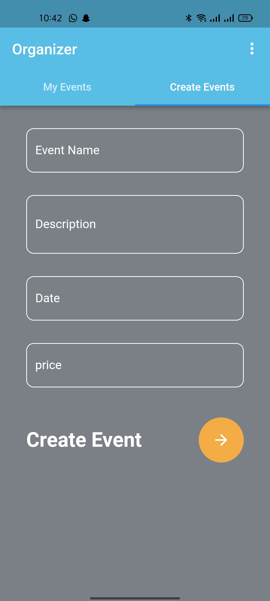
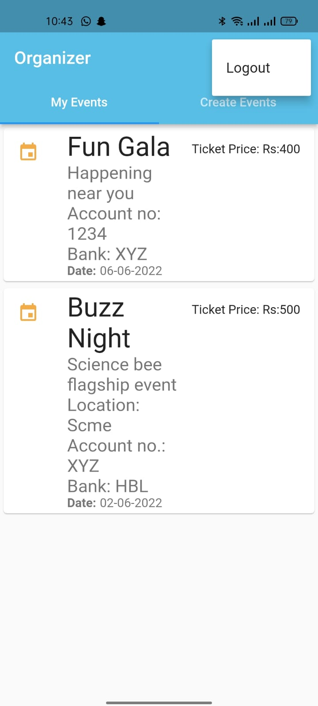

